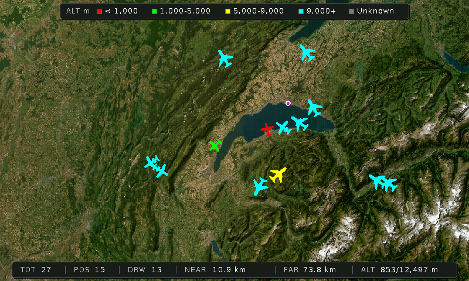

# ESP32-S3 ADSB Companion — 7" Waveshare Edition

A live ADS-B aircraft radar for the **Waveshare ESP32-S3-Touch-LCD-7** (800×480, 16 MB flash, 8 MB OPI PSRAM). Aircraft positions are overlaid on a real-time satellite map downloaded from ESRI World Imagery tiles. The map can be re-centred and zoomed directly on the touchscreen — no recompilation required.

This is the high-resolution successor to the original [ESP32-ADSB_Companion](https://github.com/HB9IIU/ESP32-ADSB_Companion) (4" CYD). All features are preserved and significantly expanded.

---

## Flash without an IDE

> **Requires Chrome or Edge** — Web Serial API is not supported in Firefox

Connect the board via USB and visit the flash page:

**[https://hb9iiu.github.io/ESP32_S3_WaveShare-ADSB-Companion/](https://hb9iiu.github.io/ESP32_S3_WaveShare-ADSB-Companion/)**

The page always serves the firmware built from the latest `main` commit. No driver installation, no IDE, no terminal needed.

---

## Screenshot



*Live aircraft overlay on ESRI World Imagery satellite map — Lake Geneva area*

---

## Key Features

- **Live satellite map** — ESRI World Imagery tiles assembled on-device; no pre-generated background image needed
- **Re-centring & zoom** — tap the screen to open the map-actions menu, drag the map centre anywhere, or enter a custom radius in km
- **Map snapshots** — save and restore a favourite view to LittleFS; reloads instantly at boot
- **Aircraft overlay** — up to 200 planes tracked simultaneously; icons rotate with heading, colour-coded by altitude
- **Aircraft trail** — short track history shown for the selected aircraft
- **Aircraft Info page** — ICAO, callsign, registration, country flag, altitude, speed, distance, bearing, route detail
- **Aircraft Picture page** — full-screen JPEG photo fetched from the Pi server
- **Statistics page** — live and all-time records (count, nearest/farthest, highest, fastest, uptime)
- **Clock screensaver** — activates after 60 s of inactivity; shows time, date, outdoor temperature
- **Automatic geolocation** — IP-based location lookup on first boot; no coordinates to configure manually
- **Automatic timezone** — UTC offset fetched from open-meteo (DST-aware); NTP sync follows automatically
- **Captive portal** — first-boot Wi-Fi setup served directly from the device (no app required)
- **Screenshot server** — built-in HTTP endpoint to capture a PNG of the current display

---

## Hardware

| Item | Detail |
|------|--------|
| Board | Waveshare ESP32-S3-Touch-LCD-7 Rev 1.2 |
| Display | 7" 800×480 RGB parallel LCD |
| Touch | GT911 capacitive (I2C) |
| Flash | 16 MB QIO |
| PSRAM | 8 MB OPI |
| Display library | LovyanGFX (RGB parallel bus — TFT_eSPI does not support this panel) |
| UI toolkit | LVGL 8.3 |

---

## Pages Overview

### Main Radar

Live satellite map with aircraft overlay. Each icon is:
- **Heading-oriented** — rotates with track angle
- **Colour-coded by altitude:**

| Colour | Altitude range |
|--------|----------------|
| Red    | 0 – 1 000 m    |
| Green  | 1 000 – 5 000 m |
| Yellow | 5 000 – 9 000 m |
| Cyan   | 9 000 m +      |
| Grey   | Unknown        |

**Touch controls:**

| Zone / Action | Result |
|---------------|--------|
| Tap an aircraft icon | Select plane → Aircraft Info page |
| Tap anywhere else | Open map-actions menu |
| Menu → Re-centre | Tap a new map centre point |
| Menu → Zoom | Enter a new view radius in km |
| Menu → Save map | Persist current view to LittleFS |
| Menu → Delete saved | Remove the stored snapshot |

---

### Aircraft Info

Detailed panel for the selected plane:
- ICAO hex, callsign, registration, country flag
- Altitude, speed, distance from home, bearing
- Aircraft type, manufacturer, operator, registered owner
- Route detail (departure / destination) fetched from the Pi server

Touch → advances to Aircraft Picture.

---

### Aircraft Picture

Full-screen JPEG photo fetched from the Pi server. Touch → advances to Statistics.

---

### Statistics

Live and all-time records from the Pi:
- Aircraft in view, unique today, unique ever, peak today, peak record
- Nearest / farthest aircraft (km) with records
- Highest altitude (m), fastest speed (km/h) with records
- Server uptime

Touch → returns to Main Radar.

---

### Clock Screensaver

Activates automatically after **60 seconds** of no touch:
- Large HH:MM display (JetBrains Mono Bold), centred
- Outdoor temperature fetched from open-meteo every 15 minutes
- Full date with correct ordinal suffix

**Touch controls:**

| Zone | Action |
|------|--------|
| Upper-left (40×40 px) | Hold to dim backlight |
| Upper-right (40×40 px) | Hold to brighten |
| Anywhere else | Return to Main Radar |

---

## Configuration

All user-facing settings are in **`src/myconfig.h`**. The only value you typically need to change before building is the ADS-B server address:

```cpp
// Base address of your Raspberry Pi ADS-B server (no trailing slash)
#define ADSB_SERVER_BASE "http://192.168.0.98:4444"
```

The map centre and radius are set automatically by IP geolocation at first boot. Fallback coordinates (used only if geolocation is unavailable) can also be overridden in this file.

---

## Persistent Settings (NVS)

| NVS key | Description | Default |
|---------|-------------|---------|
| `bl` | Main page backlight (%) | 80 % |
| `bl_clk` | Clock page backlight (%) | 30 % |
| Map snapshot | Saved centre + radius stored in LittleFS | — |

---

## First Boot — Wi-Fi Setup

On first boot (or after a factory reset), the device launches an access point named **`ADSB-Companion`**.

1. Connect your phone or computer to `ADSB-Companion`
2. A captive portal opens automatically (or browse to `192.168.4.1`)
3. Enter your Wi-Fi SSID and password and save
4. The device reboots and connects to your network

**Factory reset:** Hold the touchscreen for 3 seconds during the boot splash to erase all saved settings and re-launch the captive portal.

---

## Raspberry Pi ADS-B Receiver Setup

The ESP32 pulls aircraft data from a local ADS-B receiver running **tar1090 / dump1090**. The recommended setup uses a Raspberry Pi with the HB9IIU install script from the original companion repository.

### Hardware

- Raspberry Pi Zero 2W (or Pi 3 / 4 / 5)
- MicroSD card
- RTL-SDR dongle (RTL-SDR Blog V4 recommended)
- ADS-B antenna

### Install

Log in to your Pi via SSH and run:

```bash
wget -O hb9iiuADSBsetupRPI.sh \
  https://raw.githubusercontent.com/HB9IIU/ESP32-ADSB_Companion/main/RPI_ADSB_install_script/hb9iiuADSBsetupRPI.sh
chmod +x hb9iiuADSBsetupRPI.sh
sudo ./hb9iiuADSBsetupRPI.sh
```

Press ENTER to accept defaults. The script takes up to 12 minutes — do not interrupt it. It installs and configures readsb, tar1090, the image builder, the route-finder service (port 6969), and a lighttpd web server.

### Verify

Replace `<PI-IP>` with your Pi's IP address:

| URL | Description |
|-----|-------------|
| `http://<PI-IP>/tar1090/` | Live aircraft map |
| `http://<PI-IP>/tar1090/data/aircraft.json` | Raw JSON feed (used by ESP32) |
| `http://<PI-IP>:8080` | System status dashboard |
| `http://<PI-IP>:6969/api/flight/<icao>` | Route detail microservice |
| `http://<PI-IP>/stats_tft.json` | Statistics for the display |

---

## Build & Upload (PlatformIO)

All libraries are committed to `lib/` — a fresh clone builds with zero downloads.

```bash
pio run -e DISPLAY                   # compile firmware
pio run -e DISPLAY -t buildfs        # build LittleFS image
pio run -e DISPLAY -t upload         # flash firmware
pio run -e DISPLAY -t uploadfs       # upload LittleFS image
```

Or use the [web flasher](https://hb9iiu.github.io/ESP32_S3_WaveShare-ADSB-Companion/) for a one-click install without any toolchain.

---

## CI / Automatic Deployment

Every push to `main` triggers a GitHub Actions workflow that builds firmware and LittleFS with PlatformIO and deploys the binaries to GitHub Pages. The flash page URL always serves the latest build.

---

73 de HB9IIU
